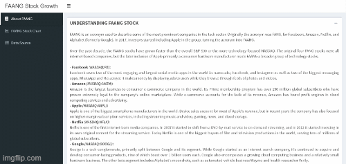

# FAANG Stock Dashboard 

This is my second capstone project at Algoritma School of Data Sciece. In this project I created a dashboard to monitor Facebook, Amazon, Apple, Netflix, Google (FAANG) stock pirce movement.

Live demo: https://vicnp.shinyapps.io/faang-stock-dashboard/

# FAANG Stock Dashboard - Behind The Scene

This project was built in [R](https://www.r-project.org) , an open source programming language using the [Shiny package](https://shiny.rstudio.com), a web application framework for R. Users will need to download [R](https://cran.uni-muenster.de/) in order to built this project and I suggest to use [RStudio](https://www.rstudio.com). R is completely free to use. All required code and library used can be found in this github repositroy.

## Input Variable 

InvestNow is using data from [Kaggle](https://www.kaggle.com/). You may download the data from [here](https://www.kaggle.com/aayushmishra1512/faang-complete-stock-data)

| Variable             	| Detail                                                                           	|
|----------------------	|----------------------------------------------------------------------------------	|
| date | Stock price date history (YYYY-MM-DD) |
| open | The position of the stock price at the opening on that day |
| high | The position of the stock price at the highest on that day |
| low | The position of the stock price at the lowest on that day   |
| close | The position of the stock price at the closing on that day |
| volume | The total number of stock volumes on that day |
| adjusted | The same as the position of the share price per share at the last time that occurred on that day but adjusted to the prevailing dividend distribution |
